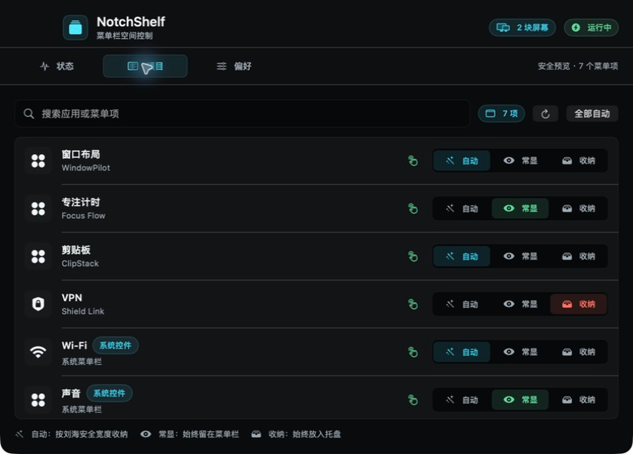
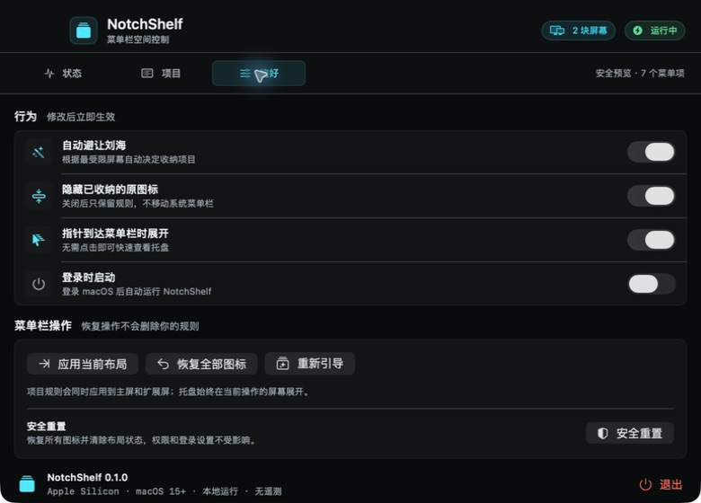
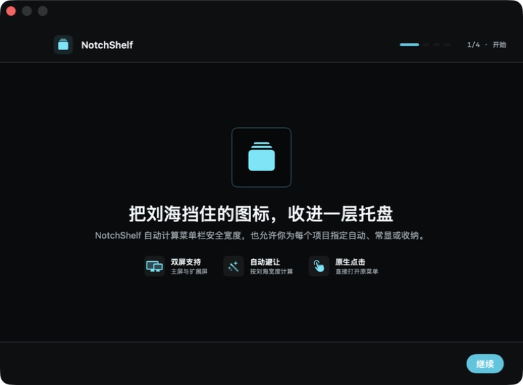

# NotchShelf

NotchShelf 是一款开源的 macOS 菜单栏收纳工具，面向带刘海的 Apple Silicon Mac。它会根据菜单栏安全宽度自动收纳可能被刘海遮挡的项目，也允许为每个项目设置“自动、常显、收纳”三态规则。


## 界面

| 项目规则 | 偏好设置 |
| --- | --- |
|  |  |

| 首次引导 | 收纳托盘 |
| --- | --- |
|  |  |

## 功能

- 自动计算当前最受限刘海屏的可用菜单栏宽度。
- 为每个菜单栏项目设置自动、始终显示或始终收纳。
- 点击托盘中的图标，继续使用原应用菜单或弹窗。
- 支持主屏和扩展屏；托盘会在当前操作的屏幕展开。
- 支持菜单栏悬停展开、登录启动、恢复布局和安全重置。
- 屏幕录制、规则计算和图标激活均在本机完成，无账号、无遥测。

## 系统要求

- Apple Silicon（M1 或更新芯片），不支持 Intel Mac。
- macOS 15.0 或更高版本。
- 辅助功能权限：识别菜单栏控件并执行原本的点击动作。
- 屏幕录制权限：只截取菜单栏图标的小区域，用于托盘显示。

## 安装

1. 打开 `NotchShelf-0.1.0.dmg`。
2. 将 `NotchShelf.app` 拖入 `Applications`。
3. 首次打开时按引导授予辅助功能和屏幕录制权限。
4. 若 macOS 提示应用来自未识别开发者，请在 Finder 中右键应用并选择“打开”。当前开源构建使用临时签名，尚未经过 Apple 公证。

不要同时运行多个会移动菜单栏项目的工具，例如 iBar、Bartender 或 Ice。它们会竞争同一组系统菜单栏位置。

## 使用

- 左键点击菜单栏的层叠图标：展开或收起托盘。
- 右键点击层叠图标：打开设置。
- 状态页：查看收纳数量、刘海安全宽度、显示器和权限状态。
- 项目页：搜索项目并设置三态规则。
- 偏好页：控制自动避让、原图标隐藏、悬停展开和登录启动。

macOS 的菜单栏项目顺序是全局状态，不支持为每块屏幕保留完全独立的排列。NotchShelf 因此使用已连接刘海屏中最小的安全宽度计算自动规则，同时把托盘显示在用户当前操作的屏幕。

## 从源码构建

需要 Xcode 16 或更高版本。项目固定输出 `arm64`：

```bash
xcodebuild \
  -project NotchShelf.xcodeproj \
  -scheme NotchShelf \
  -configuration Debug \
  -destination 'platform=macOS,arch=arm64' \
  -derivedDataPath work/DerivedData-Debug \
  CODE_SIGNING_ALLOWED=NO \
  build
```

运行独立规则测试：

```bash
./scripts/run-unit-tests.sh
```

创建 Release DMG：

```bash
./scripts/create-dmg.sh
```

产物位于 `dist/NotchShelf-0.1.0.dmg`，并附带 SHA-256 文件。

## 隐私与安全

完整说明见 [PRIVACY.md](PRIVACY.md)。NotchShelf 不包含网络请求、用户账号或分析 SDK。菜单栏图标截图仅保留在进程内存中；规则、开关和已发现项目标识保存在本机 `UserDefaults`。

录屏、麦克风、摄像头等 macOS 隐私指示器会被强制保持可见，不能设置为收纳。

## 已知限制

- 当前版本未使用 Developer ID 签名，也未经过 Apple 公证。
- macOS 更新可能改变菜单栏窗口结构，需要后续适配。
- 个别应用会动态重建菜单栏项目，NotchShelf 会周期性重新发现，但短时间内可能显示备用图标。
- 与其他菜单栏整理工具同时运行会产生布局冲突。

## 开源来源

NotchShelf 基于 MIT 许可的 [OverflowBar](https://github.com/EvanProgramming/OverflowBar) 开发，固定来源提交为 `a5f1588f8353123d2906aa18810a74e0816d1603`。原版权和许可证保留在 [LICENSE](LICENSE) 与 [NOTICE](NOTICE) 中。

欢迎通过 [CONTRIBUTING.md](CONTRIBUTING.md) 中的流程参与开发。
