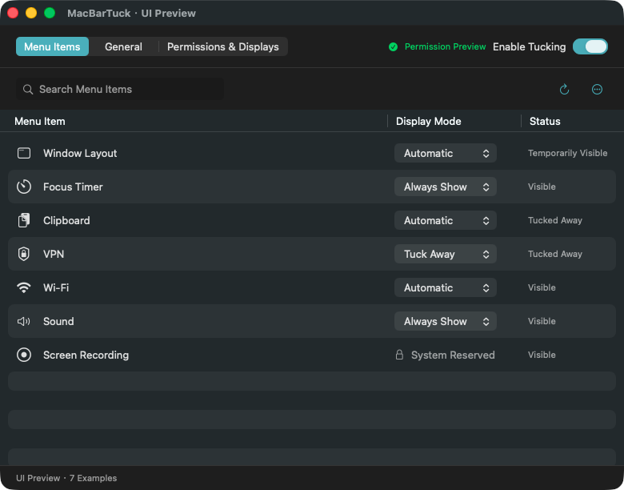
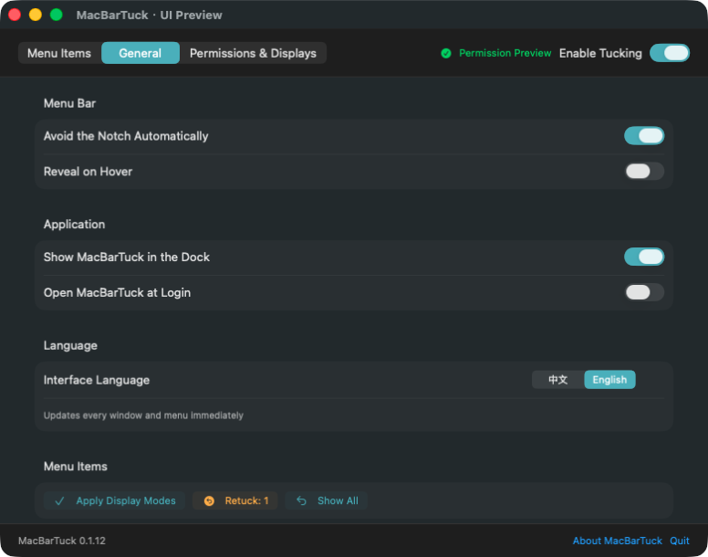

# MacBarTuck

MacBarTuck 是一款开源的 macOS 菜单栏收纳工具，面向带刘海的 Apple Silicon Mac。它会根据菜单栏安全宽度自动收纳可能被刘海遮挡的项目，也允许为每个项目设置“自动、常显、收纳”三态规则。界面支持中文和英文即时切换。


## 界面

| 权限与显示器 | 通用设置 |
| --- | --- |
|  |  |

| 首次引导 | 收纳托盘 |
| --- | --- |
|  |  |

| English menu items | English general settings |
| --- | --- |
|  |  |

## 功能

- 自动计算当前最受限刘海屏的可用菜单栏宽度。
- 为每个菜单栏项目设置自动、始终显示或始终收纳。
- 点击托盘中的图标，继续使用原应用菜单或弹窗；必须移出的隐藏图标会保持临时显示，使用完后可统一重新收纳。
- 托盘优先显示第三方应用自身的彩色图标；Wi-Fi、录屏等系统状态项保留原菜单栏图标。
- 支持主屏和扩展屏；托盘会在当前操作的屏幕展开。
- 支持可选的菜单栏悬停展开、登录启动、恢复布局和安全重置；悬停展开默认关闭。
- 支持中文和英文即时切换，并同步更新窗口、状态栏菜单、程序坞菜单和系统授权说明。
- 屏幕录制、规则计算和图标激活均在本机完成，无账号、无遥测。

## 系统要求

- Apple Silicon（M1 或更新芯片），不支持 Intel Mac。
- macOS 15.0 或更高版本。
- 辅助功能权限：识别菜单栏控件并执行原本的点击动作。
- 屏幕录制权限：只截取菜单栏图标的小区域，用于托盘显示。

## 安装

1. 打开 `MacBarTuck-0.1.12.dmg`。
2. 将 `MacBarTuck.app` 拖入 `Applications`。
3. 首次打开时按引导授予辅助功能和屏幕录制权限。
4. 若 macOS 提示应用来自未识别开发者，请在 Finder 中右键应用并选择“打开”。当前开源构建使用临时签名，尚未经过 Apple 公证。

不要同时运行多个会移动菜单栏项目的工具，例如 iBar、Bartender 或 Ice。它们会竞争同一组系统菜单栏位置。

## 使用

- 左键点击菜单栏的层叠图标：展开或收起托盘。
- 右键或 Control 点按层叠图标：打开菜单，可进入设置、调整程序坞显示或退出 MacBarTuck。
- 程序坞默认显示 MacBarTuck。右键菜单提供设置和隐藏程序坞图标，macOS 同时提供标准的隐藏、显示和退出操作。
- 在“通用 → 应用”设置程序坞图标是否显示；选择会保留到下次启动。隐藏窗口、隐藏程序坞图标均不会退出进程。
- 菜单项：搜索项目，用“显示方式”菜单选择自动、始终显示或收起。
- 托盘项目若需要先移回真实菜单栏才能打开，会标记为“临时显示”。点击托盘右侧的重新收纳按钮，可一次收回所有临时显示项，避免每次打开菜单都来回重排。
- 顶部“启用收纳”开关控制是否移动菜单项。“全部显示”会暂停收纳并恢复原图标。
- 通用：设置自动避让、悬停展开、登录启动和界面语言；重置设置会先请求确认。
- 权限与显示器：查看授权状态及当前连接的显示器。

macOS 的菜单栏项目顺序是全局状态，不支持为每块屏幕保留完全独立的排列。MacBarTuck 因此使用已连接刘海屏中最小的安全宽度计算自动规则，同时把托盘显示在用户当前操作的屏幕。

## 从源码构建

需要 Xcode 16 或更高版本。项目固定输出 `arm64`：

```bash
xcodebuild \
  -project MacBarTuck.xcodeproj \
  -scheme MacBarTuck \
  -configuration Debug \
  -destination 'platform=macOS,arch=arm64' \
  -derivedDataPath work/DerivedData-Debug \
  CODE_SIGNING_ALLOWED=NO \
  build
```

运行独立规则测试：

```bash
./scripts/run-unit-tests.sh
```

当前基础测试集包含 375 项规则、菜单身份、图标选择、权限、交互策略、应用入口及双语资源检查。`bash scripts/run-refresh-tests.sh` 另执行 10 项 Store 调度检查及诊断日志轮换检查。系统授权及激活策略测试主要使用替身，另覆盖实际 AppKit 重复设置策略的返回行为；不修改本机授权。这些测试不能代替真实收纳和点击验收。

构建 Debug 应用后运行中文、英文各 8 个安全界面冒烟场景：

```bash
./scripts/run-ui-smoke-tests.sh
```

创建 Release DMG：

```bash
./scripts/create-dmg.sh
```

产物位于 `dist/MacBarTuck-0.1.12.dmg`，并附带 SHA-256 文件。

默认仍为临时签名。已配置 Developer ID 的发布者可以通过 `MACBARTUCK_SIGNING_IDENTITY` 指定已有身份；脚本仍兼容旧的 `BARTUCK_SIGNING_IDENTITY`。它不会创建证书、修改信任设置或执行公证。详见 [权限状态与发布签名](docs/permissions.md)。

## 隐私与安全

完整说明见 [PRIVACY.md](PRIVACY.md)。MacBarTuck 不包含网络请求、用户账号或分析 SDK。菜单栏图标截图仅保留在进程内存中；规则、开关和已发现项目标识保存在本机 `UserDefaults`。

0.1.6 增加本地轮换日志，可在“通用 → 诊断”查看或导出。记录刷新来源、布局事务、窗口 ID、数值结果和错误码，不记录图标图片、窗口标题或应用内容。[刷新抖动分析](docs/layout-stability.md) 记录本次问题及验证边界。

0.1.7 将固定的系统时钟设为保留项，避免阻塞其他项目的移动；列表新增实际状态，托盘仅展示已确认隐藏的项目。“收起”是期望规则，不代表操作已成功。双屏副本有一份仍显示时会标为“部分屏幕可见”，窗口失效时标为“待确认”。

0.1.8 将产品名称更新为 MacBarTuck。Bundle ID、用户设置、诊断日志目录和状态栏定位标识保持不变，用于兼容已安装的 BarTuck 版本。

0.1.9 增加中文、英文即时切换，覆盖设置页、首次引导、收纳托盘、状态栏菜单、程序坞菜单和屏幕录制授权说明。语言选择会保留到下次启动，切换过程不会触发菜单栏扫描或布局移动。

0.1.10 优先解决菜单栏抖动：直接激活不再触发布局事务；必须移出的隐藏项目只移动一次并保持临时显示，不再在菜单或弹窗关闭后立即拖回。托盘和设置页提供显式“重新收纳”，悬停展开默认关闭，主状态图标保持固定，弹簧缩放动画改为短淡入淡出；设置窗口回到前台时只复查应用状态，不再触发完整菜单扫描。

0.1.11 改进托盘辨识度：第三方项目优先使用解析到的应用彩色图标，系统状态项仍使用自身菜单栏图标；应用图标增至 28 pt，系统图标保持 22 pt，固定槽位和点击区域同步扩大。面板宽度按实际图标间距与操作区计算，避免最右侧图标被分隔线裁切。

0.1.12 明确“重新收纳”操作：托盘不再使用容易被误认为下载的向下箭头和孤立数字，改为琥珀色固定宽度按钮，直接显示“重新收纳 1 项”或 `Retuck: 1`；通用设置页使用相同图标、文案和颜色。

录屏、麦克风、摄像头等 macOS 隐私指示器会被强制保持可见，不能设置为收纳。

## 已知限制

- 当前版本未使用 Developer ID 签名，也未经过 Apple 公证。
- macOS 更新可能改变菜单栏窗口结构，需要后续适配。
- 个别应用会动态重建菜单栏项目，MacBarTuck 会周期性重新发现，但短时间内可能显示备用图标。
- 与其他菜单栏整理工具同时运行会产生布局冲突。
- 0.1.0 的已授权双屏实测发现分隔项越界和本应用镜像误识别；0.1.1 已修正相关代码并增加回归测试，但真实收纳、点击与双屏托盘仍需在修复版上复测。详见 [测试记录](docs/runtime-qa.md)。
- 临时签名的应用在更新代码后可能需要重新授予系统权限。macOS 15、27 和显示器热插拔尚未完成实机验收。
- 0.1.2 在有完整窗口元数据及自身菜单栏定位标记时，保守关联双屏镜像；歧义或缺失标记时保留独立条目。未识别项目使用独立编号，匿名项目规则只在本次运行有效，以免下次启动误作用到别的应用。
- 未获有效录屏权限时不显示缺失身份信息的窗口列表。只有真实菜单栏图像成功读取，相关项目才可被隐藏；应用备用图标不计入成功采集数量。

## 开源来源

MacBarTuck 基于 MIT 许可的 [OverflowBar](https://github.com/EvanProgramming/OverflowBar) 开发，固定来源提交为 `a5f1588f8353123d2906aa18810a74e0816d1603`。原版权和许可证保留在 [LICENSE](LICENSE) 与 [NOTICE](NOTICE) 中。

欢迎通过 [CONTRIBUTING.md](CONTRIBUTING.md) 中的流程参与开发。

额外的功能参考、许可证边界及扩展优先级见 [开源参考](docs/open-source-references.md)。
